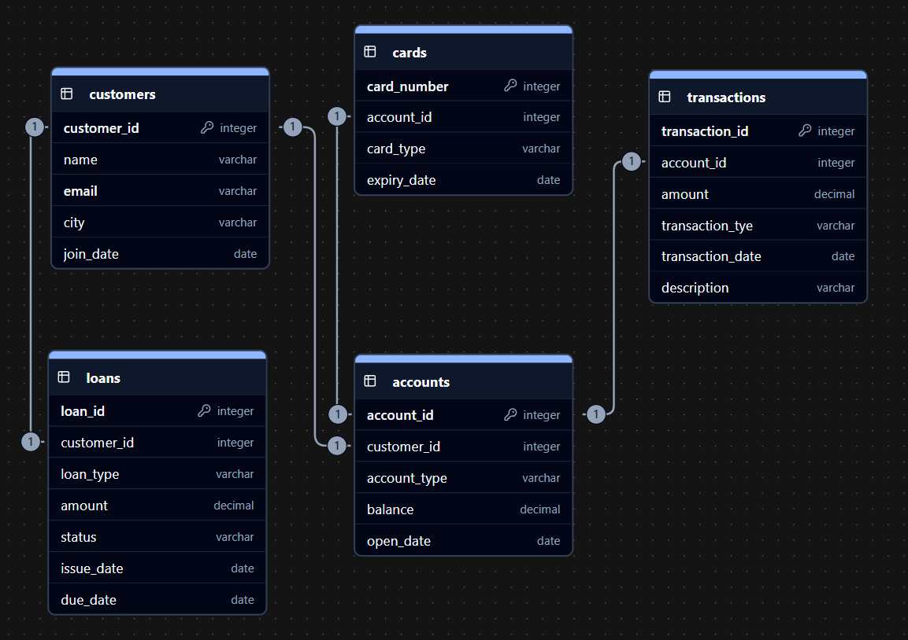

> Note:- Oracle SQL is being used

## 1. Database Overview

- **Database / Schema:** banks
- **Description:** It captures accounts, cards, customers, loans, and transactions to enable analysis of banking analysis like track account details, loans, card details and so on.

---

## 2. Tables

1. **accounts**
   - account_id _(PK)_, customer_id _(FK)_, account_type, balance, open_date
2. **cards**
   - card_number _(PK)_, account_id _(FK)_, card_type, expiry_date
3. **customers**
   - customer_id _(PK)_, name, email, city, join_date
4. **loans**
   - loan_id _(PK)_, customer_id _(FK)_, loan_type, amount, status, issue_date, due_date
5. **transactions**
   - transaction_id _(PK)_, account_id _(FK)_, amount, transaction_type, transaction_date, description

---

## 3. Entities & Relationships

