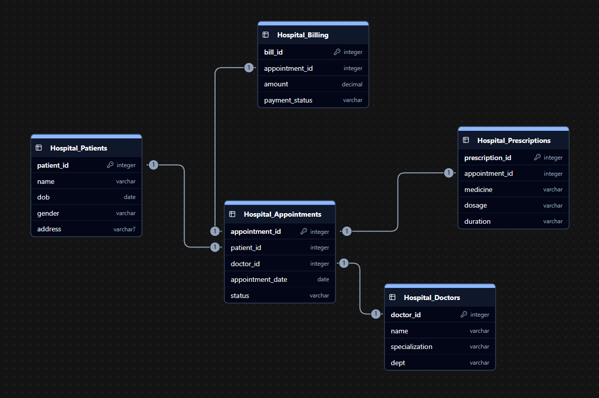

> Note:- Oracle SQL is being used

## 1. Database Overview

- **Database / Schema:** HospitalDB
- **Description:** Database designed to manage hospital operations including patients, doctors, appointments, prescriptions, and billing.

---

## 2. Tables

1. **Hospital_Patients**
   - patient_id _(PK)_, name, dob, gender, address
2. **Hospital_Doctors**
   - doctor_id _(PK)_, name, specialization, dept
3. **Hospital_Appointments**
   - appointment_id _(PK)_, patient_id _(FK)_, doctor_id _(FK)_, appointment_date, status
4. **Hospital_Prescriptions**
   - prescription_id _(PK)_, appointment_id _(FK)_, medicine, dosage, duration
5. **Hospital_Billing**
   - bill_id _(PK)_, appointment_id _(FK)_, amount, payment_status

---

## 3. Entities & Relationships

