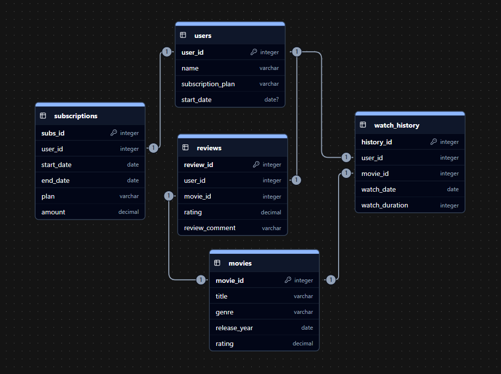

> Note:- Oracle SQL is being used

## 1. Database Overview

- **Database / Schema:** netflix
- **Description:** It captures users, subscriptions, movies, watch history, and reviews to enable analysis of user engagement, subscription revenue, and movie performance.

---

## 2. Tables

1. **users**
   - user_id _(PK)_, name, subscription_plan, start_date
2. **subscriptions**
   - subs_id _(PK)_, user_id _(FK)_, start_date, end_date, plan, amount
3. **movies**
   - movie_id _(PK)_, title, genre, release_year, rating
4. **watch_history**
   - history_id _(PK)_, user_id _(FK)_, movie_id _(FK)_, watch_date, watch_duration
5. **reviews**
   - review_id _(PK)_, user_id _(FK)_, movie_id _(FK)_, rating, review_comment

---

## 3. Entities & Relationships

